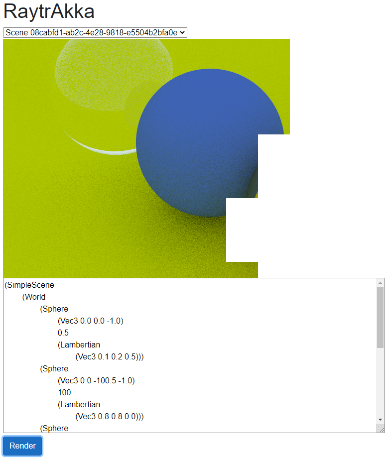

# raytrakka
A distributed raytracer with scenes constructed using lisp. Use AKKA .NET to handle distributing workload across nodes. Deploy on kubernetes using helm charts. 

Raytracer is basically a C# port of https://raytracing.github.io/books/RayTracingInOneWeekend.html. 

Lisp interpreter is heavily based on work of https://www.lucabol.com/posts/2011-06-30-write-yourself-a-scheme-in-48-hours-in-f-part-i/ which makes https://en.wikibooks.org/wiki/Write_Yourself_a_Scheme_in_48_Hours more accessible
to an F# crowd.

Overall Akka .Net configuration is inspired by http://www.rickyterrell.com/?p=197.

